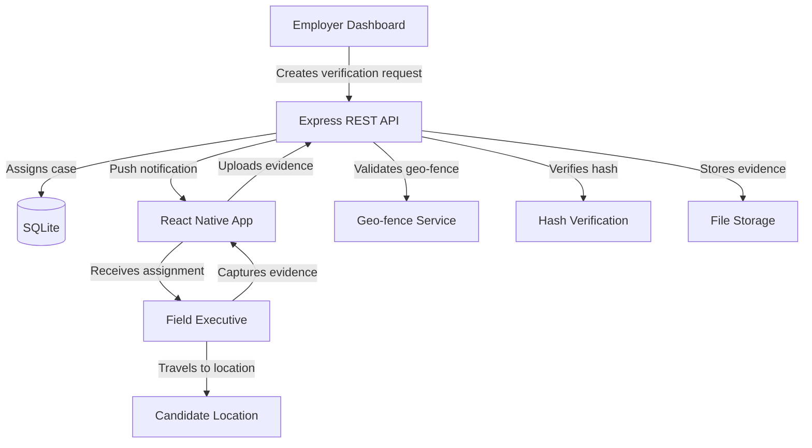

# Architecture

## System Overview

## Data Flow

1. **Assignment Creation**: Employer submits verification request → API creates assignment → pushes to assigned Field Executive
2. **Evidence Collection**: Field Executive opens assignment → app verifies GPS is within geo-fence → captures photo with watermark → hashes photo → stores locally
3. **Evidence Submission**: App submits evidence (photo + GPS + hash + timestamp) → API validates geo-fence, hash integrity, and timestamp → stores evidence → marks assignment complete
4. **Offline Flow**: If offline, evidence queued in local SQLite → auto-synced when connectivity returns

## Component Boundaries

### Mobile App
- **Screens**: thin UI layer — renders data, captures user input
- **Hooks**: encapsulate native module access (GPS, camera, biometrics)
- **Services**: business logic (API client, sync queue, evidence processing)
- **Store**: global state (Zustand) — auth status, active assignment, sync state
- **DB**: SQLite for offline data and sync queue

### Server API
- **Routes → Controllers → Services → DAOs**: strict layered architecture
- **Middleware**: cross-cutting concerns (auth, validation, file upload, errors)
- **Services**: all business logic (geo-fence validation, evidence verification)
- **DAOs**: single point of database access

## Key Design Decisions

| Decision | Choice | Rationale |
|----------|--------|-----------|
| Monorepo | Yes | Shared types, simpler CI, co-located changes |
| Offline-first | SQLite sync queue | Field executives often in low-connectivity areas |
| Evidence integrity | SHA-256 hash + server verify | Prevents photo tampering after capture |
| Geo-fence | Server-side validation | Client GPS can be spoofed |
| Auth | JWT + biometric gate | Balance security with UX |
| Database | SQLite (both) | No external DB dependency, portable |
