# Design Workflow

## 1. System Overview

FullScanFieldApp is an enterprise field verification system that ensures physical presence at candidate locations with tamper-proof evidence. The system connects Employers (who request verifications), Admins (who manage assignments), and Field Executives (who perform on-site verification).

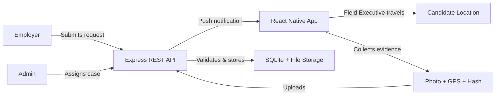

---

## 2. Architecture Workflow

### 2.1 Monorepo Structure

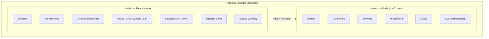

### 2.2 Layered Architecture (Server)

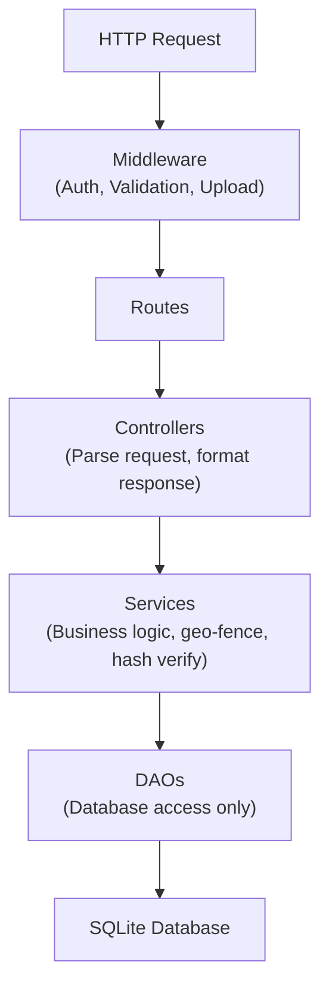

### 2.3 Mobile Component Architecture

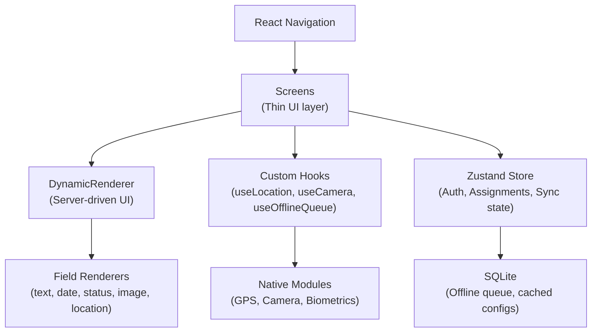

---

## 3. User Workflows

### 3.1 Employer Workflow

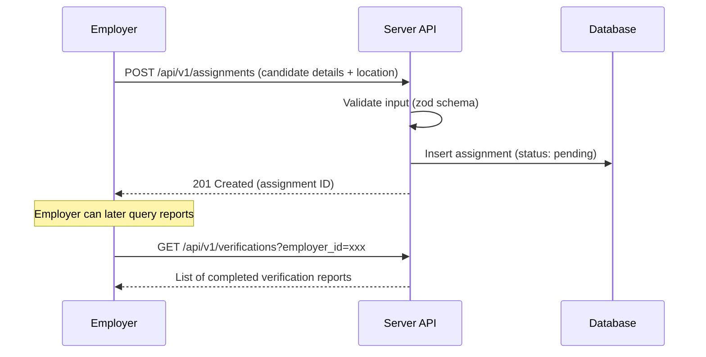

### 3.2 Admin Workflow

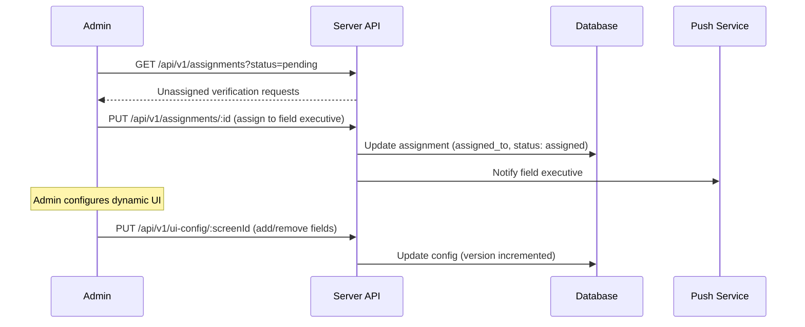

### 3.3 Field Executive Workflow

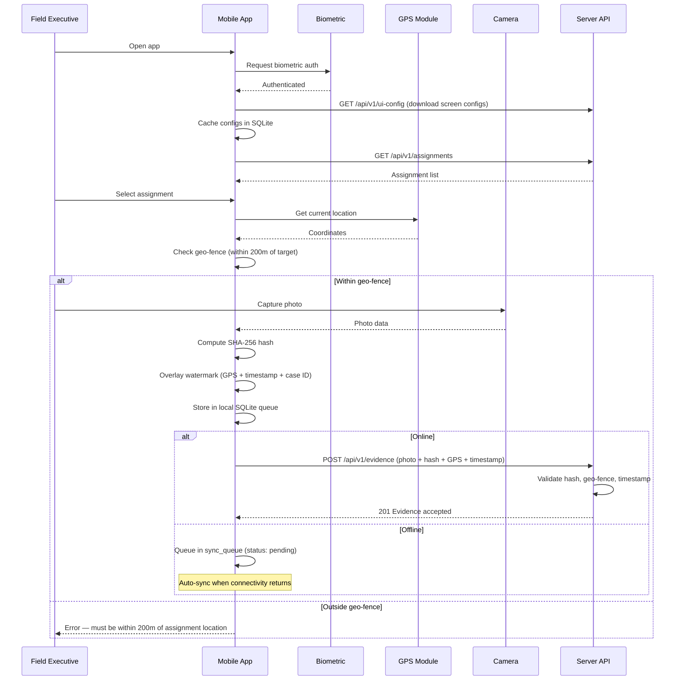

---

## 4. Technical Workflows

### 4.1 Authentication Flow

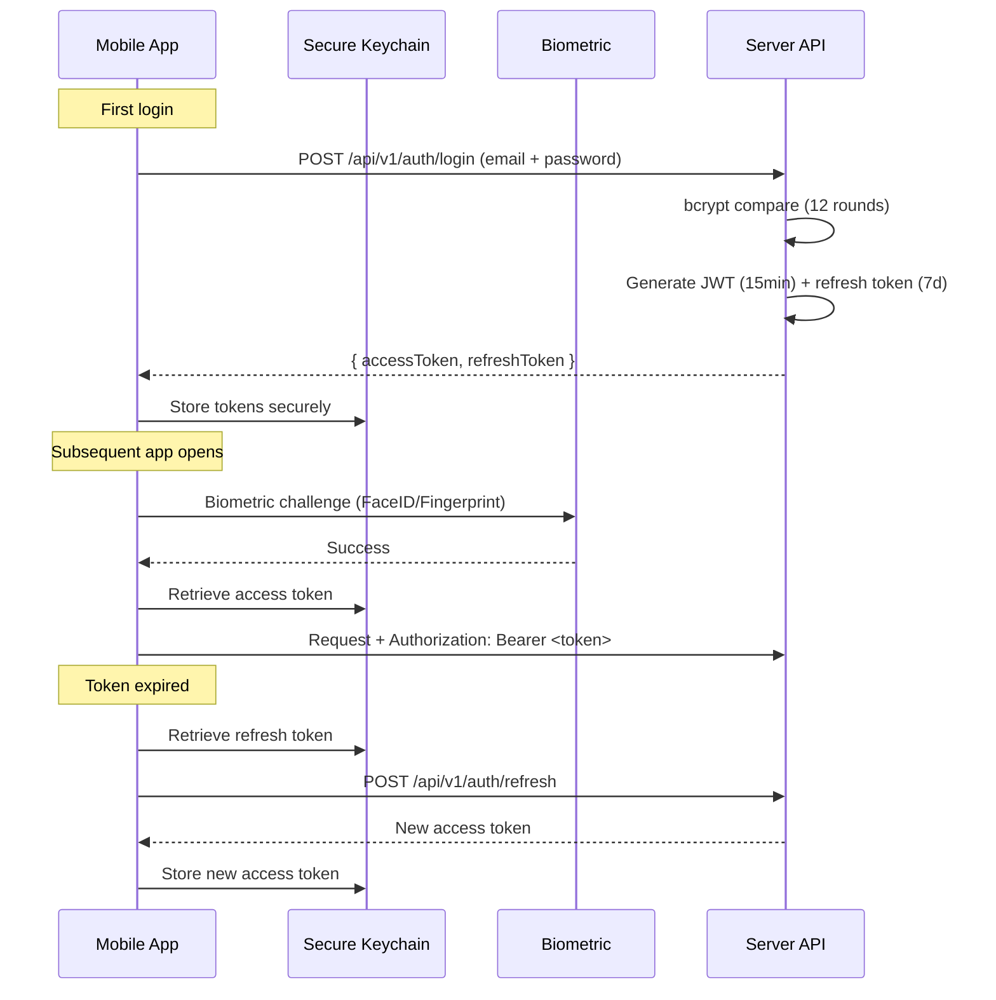

### 4.2 Evidence Capture & Integrity Chain

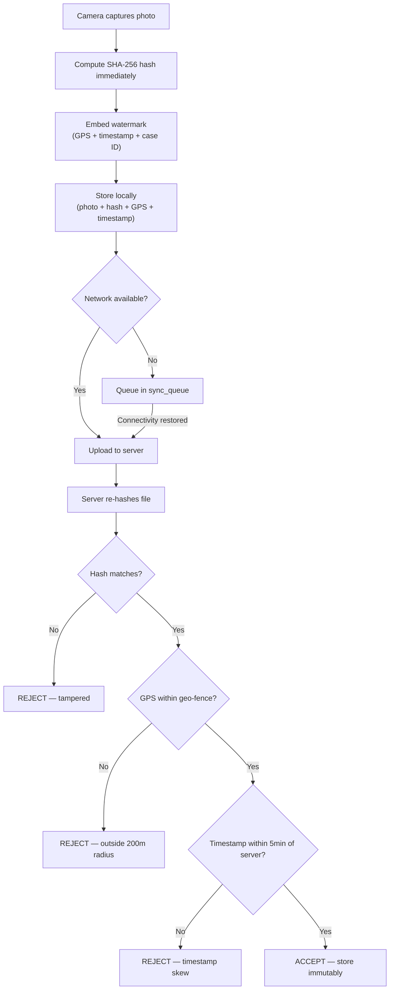

### 4.3 Offline Sync Queue Workflow

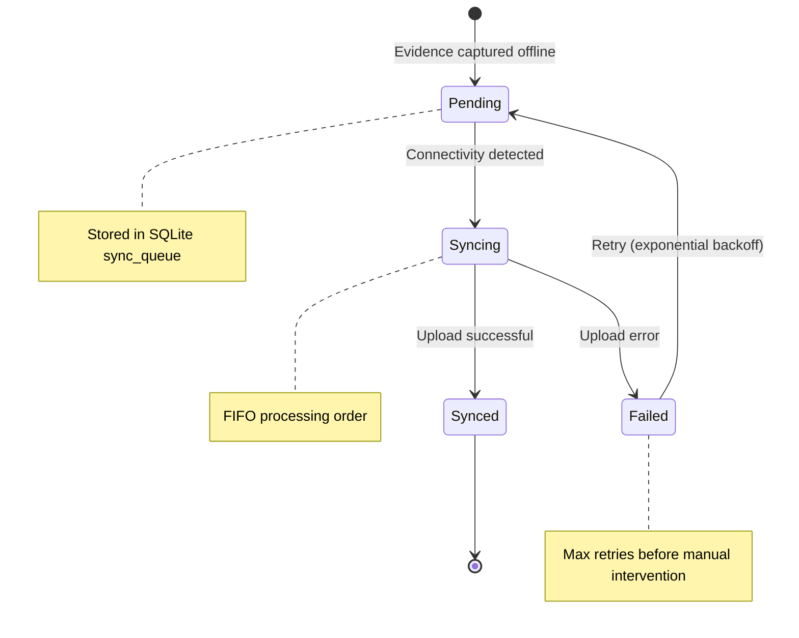

**Sync Queue Table Schema:**
| Column | Type | Description |
|--------|------|-------------|
| id | TEXT (UUID) | Queue entry ID |
| type | TEXT | Operation type (evidence_upload, report_submit) |
| payload | TEXT (JSON) | Serialized request data |
| status | TEXT | pending / syncing / synced / failed |
| retry_count | INTEGER | Number of retry attempts |
| created_at | TEXT | ISO 8601 timestamp |

### 4.4 Server-Driven UI Workflow

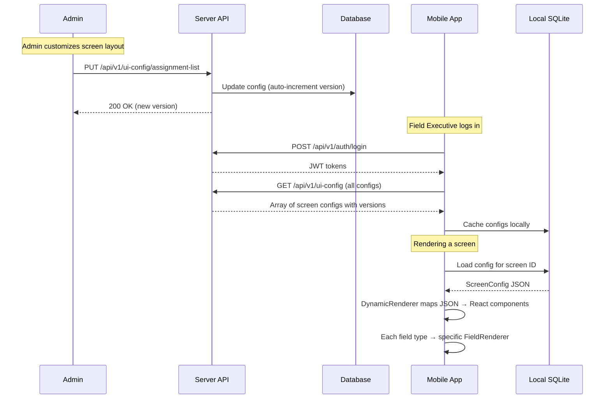

**Dynamic Rendering Pipeline:**

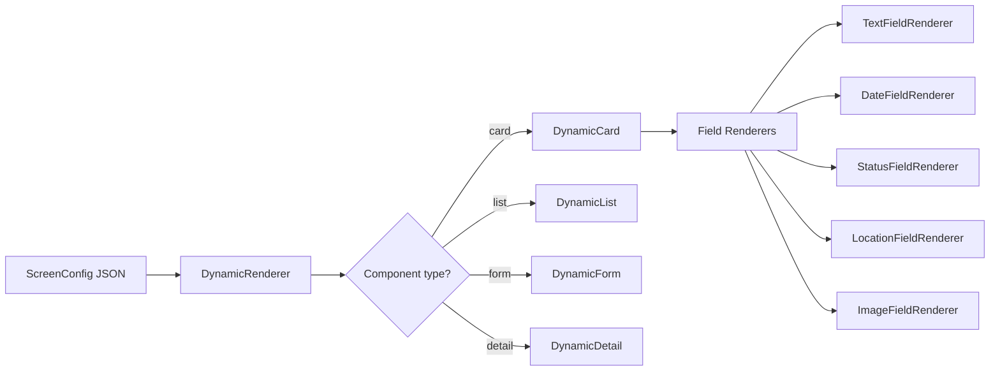

### 4.5 Geo-Fence Validation Workflow

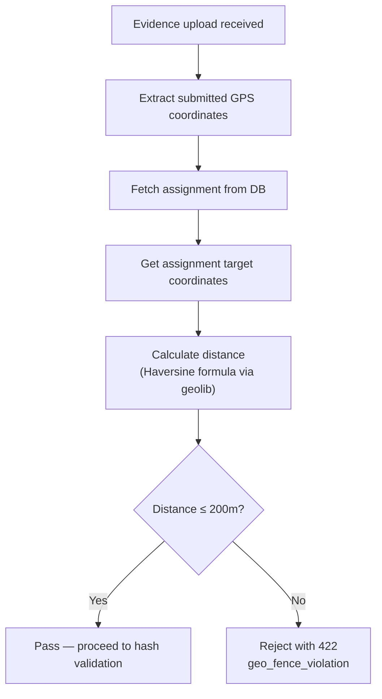

---

## 5. Data Flow Architecture

### 5.1 Server Database Schema

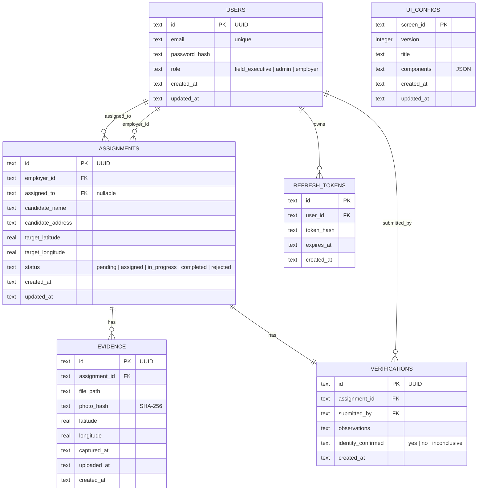

### 5.2 Mobile Local Database Schema

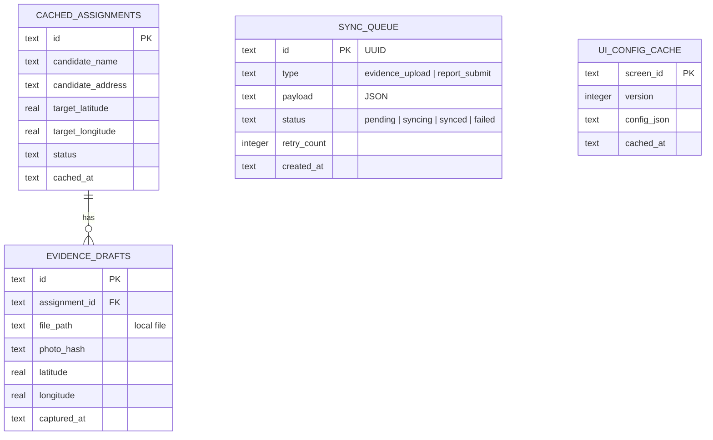

---

## 6. Security Workflow

### 6.1 Threat Mitigation Pipeline

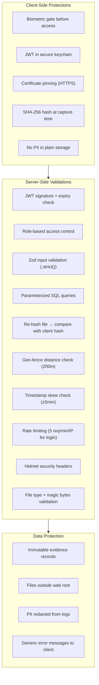

### 6.2 Role-Based Access Matrix

| Resource | Field Executive | Admin | Employer |
|----------|----------------|-------|----------|
| View own assignments | ✅ | ✅ (all) | ❌ |
| Create assignments | ❌ | ✅ | ✅ |
| Upload evidence | ✅ | ❌ | ❌ |
| Submit verification report | ✅ | ❌ | ❌ |
| View reports | Own only | ✅ (all) | Own requests |
| Manage users | ❌ | ✅ | ❌ |
| Configure UI | ❌ | ✅ | ❌ |

---

## 7. Development Workflow

### 7.1 Tech Stack Summary

| Layer | Core Technologies |
|-------|-------------------|
| Mobile UI | React Native 0.73+, @gluestack-ui/themed, React Navigation 6 |
| Mobile State | Zustand, TanStack React Query |
| Mobile Offline | react-native-sqlite-storage, sync queue |
| Mobile Native | react-native-vision-camera, react-native-geolocation-service, react-native-biometrics |
| Mobile Security | react-native-keychain, react-native-quick-crypto |
| Server Runtime | Node.js 20 LTS, Express 4.x, TypeScript 5.x |
| Server DB | better-sqlite3, manual migrations |
| Server Validation | zod (shared type inference) |
| Server Auth | jsonwebtoken, bcryptjs |
| Server Security | helmet, express-rate-limit, cors |
| Server Geo | geolib (Haversine distance) |
| Testing | Jest + @testing-library/react-native (mobile), Vitest + supertest (server) |

### 7.2 Build & Run Pipeline

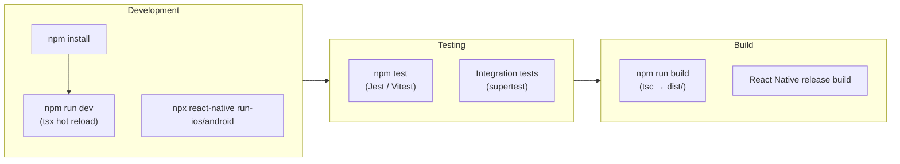

### 7.3 Code Conventions

- **TypeScript strict mode** in both packages
- **Naming**: kebab-case files, PascalCase components, camelCase functions, UPPER_SNAKE_CASE constants
- **Imports**: external → internal → relative (path aliases: `@/services`, `@/components`)
- **Styles**: ALL in `src/theme/`, no inline styles, light/dark theme support mandatory
- **Localization**: react-i18next, all user-visible strings localized (en, hi, te)
- **Security**: parameterized queries, zod strict validation, no raw SQL in controllers

---

## 8. API Request/Response Lifecycle

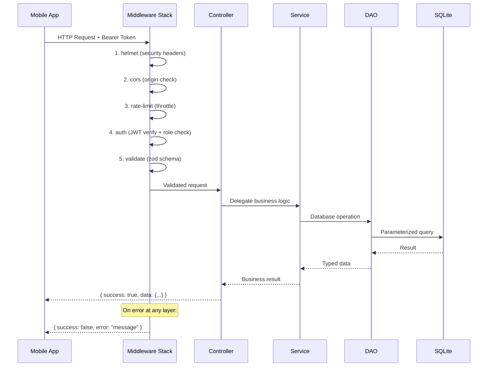

---

## 9. End-to-End Verification Workflow

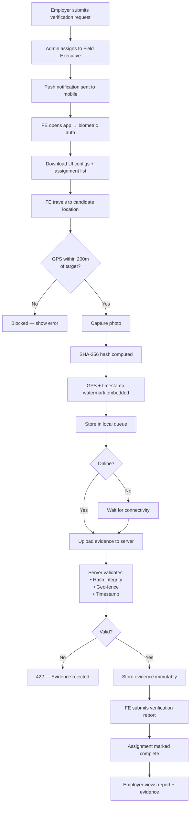

---

## 10. Future Architecture Considerations

| Area | Current | Future |
|------|---------|--------|
| Database | SQLite (single-instance) | PostgreSQL (multi-instance) |
| File Storage | Local disk | S3 / Azure Blob Storage |
| Real-time Updates | Polling | WebSocket notifications |
| Push Notifications | FCM/APNs (planned) | Integrated push service |
| Deployment | Single Node.js process | Container orchestration |
| Monitoring | pino logs | Centralized logging + APM |
