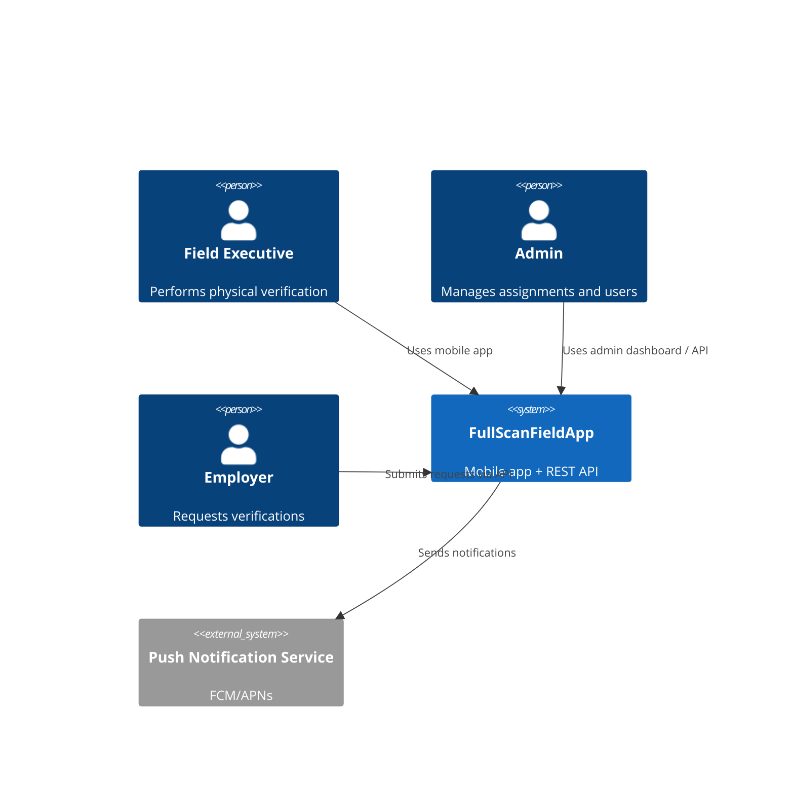

# Software Architecture Document (SAD)

## 1. Architecture Style
Monorepo with two-tier architecture: mobile client + REST API server.

## 2. System Context

## 3. Component Architecture

### 3.1 Mobile App
| Component | Responsibility |
|-----------|---------------|
| Screens | UI rendering, user interaction |
| Navigation | Screen routing, deep links |
| Hooks | Native module abstraction (GPS, camera, biometrics) |
| Services | Business logic, API communication |
| Store (Zustand) | Global state management |
| SQLite DB | Offline data, sync queue |

### 3.2 Server API
| Component | Responsibility |
|-----------|---------------|
| Routes | HTTP endpoint definitions |
| Controllers | Request parsing, response formatting |
| Services | Business logic, validation |
| DAOs | Database access layer |
| Middleware | Auth, validation, upload, error handling |

## 4. Data Architecture

### 4.1 Server Database (SQLite)
- `users` — accounts with roles
- `assignments` — verification tasks with candidate location
- `evidence` — photos with GPS, hash, timestamps
- `verifications` — completed verification reports
- `refresh_tokens` — active refresh tokens

### 4.2 Mobile Database (SQLite)
- `cached_assignments` — offline copy of assigned work
- `evidence_drafts` — captured but not yet uploaded evidence
- `sync_queue` — pending API operations

## 5. Deployment

### Current
- Server: single Node.js process + SQLite file
- Mobile: distributed via TestFlight (iOS) / internal APK (Android)

### Future Considerations
- PostgreSQL for multi-instance server deployment
- Cloud file storage (S3/Azure Blob) for evidence photos
- WebSocket for real-time assignment updates
