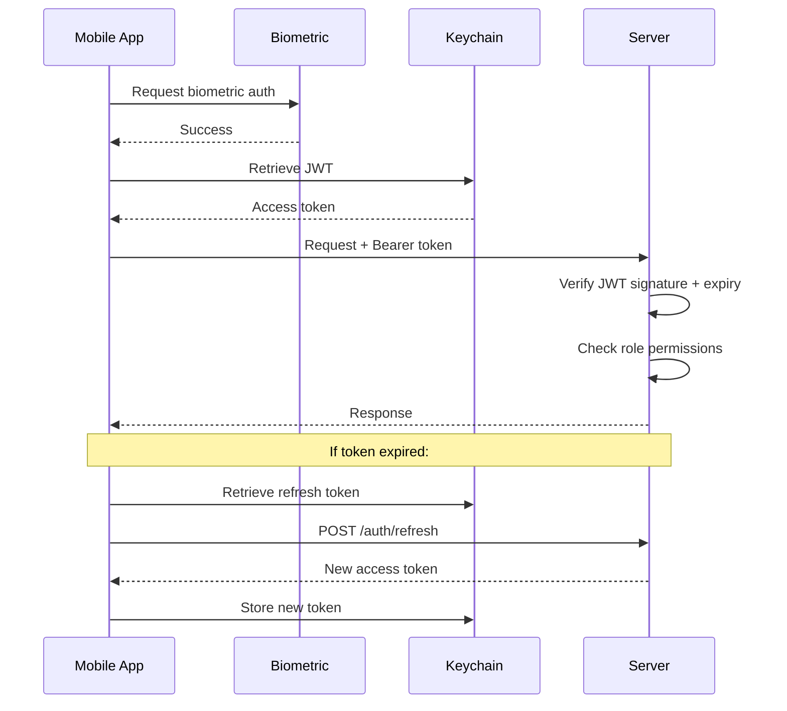

# Security Model

## Overview

FullScanField handles sensitive personal data (candidate information, photos, locations) and must ensure evidence cannot be fabricated. Security is the highest priority.

## Threat Model

| Threat | Mitigation |
|--------|-----------|
| Fake visit (no physical presence) | GPS geo-fence validation (server-side, 200m radius) |
| Photo from gallery/internet | Photo hash computed at capture, verified on upload |
| GPS spoofing on device | Server-side geo-fence check; timestamp correlation |
| Token theft | Short-lived JWT (15min); refresh tokens (7d); biometric gate |
| Data interception | HTTPS only; certificate pinning on mobile |
| Brute-force login | Rate limiting (5 attempts/min/IP) |
| SQL injection | Parameterized queries only; zod input validation |
| XSS via API | Input sanitization; helmet headers; no HTML rendering from user input |
| Unauthorized access | Role-based middleware on every route |
| Evidence tampering post-upload | Immutable evidence records; SHA-256 hash stored at creation |

## Authentication Flow

## Evidence Integrity Chain

1. **Capture**: Camera captures photo → app immediately computes SHA-256 hash
2. **Watermark**: GPS coordinates + timestamp + case ID overlaid on photo
3. **Local Storage**: Photo + hash + GPS + timestamp stored in SQLite queue
4. **Upload**: Photo file + metadata sent to server
5. **Server Validation**:
   - Re-hash uploaded file → compare with submitted hash
   - Check GPS against assignment geo-fence (200m default)
   - Validate timestamp (reject if >5min skew from server time)
6. **Storage**: Evidence stored immutably; hash recorded in database

## Data Protection

### At Rest
- Mobile: sensitive data in keychain (encrypted by OS); SQLite for non-sensitive cached data
- Server: SQLite database file; file uploads on disk (outside web root)

### In Transit
- HTTPS required for all API communication
- Certificate pinning on mobile to prevent MITM

### PII Handling
- Candidate names, phone numbers, addresses never logged
- Logs use pino with redaction rules for sensitive fields
- Error responses contain generic messages, never PII

## Role-Based Access Control

| Role | Permissions |
|------|------------|
| `field_executive` | View own assignments, upload evidence, submit reports |
| `admin` | All operations; manage users and assignments |
| `employer` | Create verification requests, view reports for own requests |
