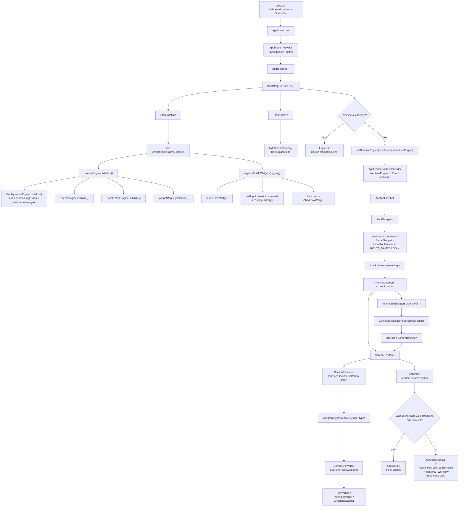

# FullScan — Execution Flow (App.tsx → Rendered Login Screen)

This document traces the actual current execution path from app startup through to the
rendered, configuration-driven Login screen, based on the code as it exists today
(not the target architecture in `docs/`). It reflects the "Hello Runtime" sprint state:
Bootstrap → Runtime Engine → Navigation → Dynamic Form Engine → Widget Registry → Widgets,
with the Workflow Engine still a skeleton.

## 1. Flowchart



## 2. App bootstrap: `App.tsx` → ready runtime

### Step 1 — `App.tsx` (root)
`App.tsx` is the RN entry component. On render it reads `useColorScheme()`, logs via
`LoggerService`, wraps everything in `SafeAreaProvider` + Gluestack `StatusBar`, and renders
`<Application />`. It does no bootstrapping itself — only safe-area/status-bar concerns.

### Step 2 — `Application.tsx` (composition root)
Just nests `<ApplicationProvider><ApplicationShell /></ApplicationProvider>`.
`ApplicationProvider` owns the async bootstrap lifecycle; `ApplicationShell` owns what to
render once ready.

### Step 3 — `ApplicationProvider.tsx` runs the Bootstrap Pipeline
A `useEffect` calls `runBootstrap()` exactly once on mount. While `runtimeEngine` state is
`undefined`, it renders a themed `Spinner` (wrapped in `ThemeProvider` + `AppSafeArea`, so
even the loading state is themed and safe-area-correct). This is the only React-level loading
gate — the native splash screen is handled separately by BootSplash.

`runBootstrap()` builds a `BootstrapPipeline` with two steps, run in order, stopping at the
first failure:

1. **`runtime` step**
   - `new VerificationRuntimeEngine()` then `.initialize()`
   - `registerBuiltInWidgets(runtimeEngine.getWidgetRegistry())`
   - Stashes `runtimeEngine` into the pipeline's shared context
2. **`splash` step**
   - Calls `hideSplashScreen()` → `BootSplash.hide({ fade: true })`, revealing the React tree

`BootstrapPipeline.run()` iterates steps, `try/catch`-ing each; on failure it returns
`{ success: false, failedStep }` without throwing, so `ApplicationProvider` just logs an
error and stays on the spinner (no retry/crash UI yet — acceptable for this sprint).

On success, `ApplicationProvider` calls `setRuntimeEngine(result.context.runtimeEngine)`,
flipping to the "ready" branch: `ThemeProvider` wrapping `ApplicationContext.Provider` (a
plain React Context) supplying the engine instance down to `children` (`ApplicationShell`).

### Step 4 — Inside `VerificationRuntimeEngine.initialize()`
Sequentially initializes four engines:

1. **ConfigurationEngine.initialize()** — loads a hardcoded `SAMPLE_CONFIGURATION` object (no
   networking yet), built from two bundled JSON files (`runtime-preview.json`, `login.json`)
   under `src/runtime/configuration/screens/`. Validates version fields + unique `screenId`s
   before activating; on failure it leaves `activeConfiguration` undefined (no rollback
   target exists yet).
2. **ThemeEngine.initialize()** — resolves design tokens/mode.
3. **LocalizationEngine.initialize()** — sets up i18next language.
4. **WidgetRegistry.initialize()** — clears its internal `Map<WidgetType, WidgetFactory>`.

`registerBuiltInWidgets` then registers the built-in widgets — `text`, `textInput` (also
aliased as `email`/`password`), `checkbox` — into that registry.

### Step 5 — `ApplicationShell.tsx` renders the navigation stack
Once the engine is in context, `ApplicationShell` calls `useRuntimeEngine()` to pull it out
of `ApplicationContext`, then renders:

```tsx
<AppSafeArea>
  <RootNavigator runtimeEngine={runtimeEngine} />
</AppSafeArea>
```

It no longer resolves or renders a screen directly — that responsibility moved into
`src/navigation/` (see below).

## 3. Navigation — real, but deliberately shallow

`src/navigation/` now contains a working `@react-navigation/native` stack, not just a README:

- `routes.ts` — `ROUTE_NAMES.LOGIN = 'login'` and `RootStackParamList`. Route names are the
  same `screenId` strings the Configuration Engine uses, so a screen keeps one identity
  end-to-end instead of a separate navigation alias that could drift.
- `root-navigator.tsx` — `RootNavigator({ runtimeEngine })` renders a real
  `NavigationContainer` + `createNativeStackNavigator()`, with `initialRouteName:
  ROUTE_NAMES.LOGIN` and a single `Stack.Screen` for `login`, rendering `RuntimeScreen`.
- `runtime-screen.tsx` — `RuntimeScreen({ screenId, runtimeEngine })` is the single generic
  route host: since every screen is entirely configuration-driven, there is no per-screen
  React component to author, only a `screenId` to resolve. It calls
  `runtimeEngine.getScreen(screenId)` and renders `ScreenRenderer` with the result.
  `handleAction` still only logs — deciding what happens after an action belongs to the
  Workflow Engine, which remains a skeleton.

Design notes:
- `runtimeEngine` reaches `RuntimeScreen` via **props**, passed down through
  `RootNavigator`'s `Stack.Screen` render-prop — not via `useRuntimeEngine()` inside the
  screen itself. `ApplicationContext` still exists and still gates when `ApplicationShell`
  (and therefore `RootNavigator`) is allowed to mount at all.
- Only one route is registered. There is nothing yet to decide "what screen follows Login" —
  that is explicitly deferred to the Workflow Engine. Login stays the only registered route
  until it exists and more screens are wired in.
- Net effect: navigation is genuinely wired (a real navigator/container exists and screens
  are legitimately routed through it), but with a single destination — pressing submit
  validates the form and logs the action; it does not `navigate()` anywhere.

## 4. How the login JSON loads

1. `configuration-engine.ts` statically imports `screens/login.json` and
   `screens/runtime-preview.json` at module load time. Metro bundles these directly into the
   JS bundle — no fetch, no filesystem read at runtime.
2. They're assembled into one in-memory `SAMPLE_CONFIGURATION` object shaped like a real
   `ConfigurationPackage` (`configurationVersion`, `minimumAppVersion`, `generatedOn`,
   `screens[]`) — deliberately mirroring what a downloaded package will look like later.
3. During bootstrap, `VerificationRuntimeEngine.initialize()` calls
   `configurationEngine.initialize()`, which runs `isValidConfigurationPackage()` — checks
   version fields are present and `screenId`s are unique — before setting
   `this.activeConfiguration = candidate`. An invalid package is simply never activated.
4. `RuntimeScreen` calls `runtimeEngine.getScreen('login')` →
   `VerificationRuntimeEngine.getScreen()` → `configurationEngine.getScreen('login')`, which
   does `activeConfiguration.screens.find(s => s.screenId === 'login')` and returns the
   parsed `login.json` object typed as `ScreenDefinition`.

`login.json` shape:
```
screenId: "login", layout: "scroll", workflowId: "login"
sections:
  - branding (order 1): [ text: welcomeMessage ]
  - credentials (order 2): [ textInput: username, password: password,
                              checkbox: rememberMe, textInput: employeeId ]
actions: ["submit"]
```
`workflowId: "login"` is already present in the JSON — configuration is ahead of the code
here; nothing currently reads that field since the Workflow Engine isn't wired up yet.

## 5. How the fields render

Once `ScreenRenderer` has the `ScreenDefinition`:

1. **Sections** — filters `visible !== false` sections and sorts by `order` (`branding` →
   `credentials`), mapping each to a `<SectionRenderer>`.
2. **Widgets within a section** — same filter/sort applied to each section's widgets by their
   own `order`.
3. **Resolving a component per widget** — `registry.resolve(widget.type)` looks up the Widget
   Registry's `Map<WidgetType, WidgetFactory>`:
   - `"text"` → `TextWidget`
   - `"textInput"`, `"email"`, `"password"` → all three map to the same `TextInputWidget`,
     differentiated only by `secureTextEntry` / `keyboardType` props derived from
     `definition.type` inside the component
   - `"checkbox"` → `CheckboxWidget`

   An unregistered `type` logs a warning and is skipped rather than crashing the whole
   screen.
4. **Binding value/error/onChange** — each resolved widget is wrapped in `ConnectedWidget`,
   which calls `useFormField(widget.widgetId)`. That hook reads from `FormStateContext`
   (provided by `ScreenRenderer`'s own `values`/`errors` state) and returns `{ value, error,
   onChange }` keyed by `widgetId`.
5. **Rendering per widget type**:
   - `TextWidget` — stateless; resolves `t(definition.labelKey)` via i18next, renders
     Gluestack `<Text>` (used for the static welcome message).
   - `TextInputWidget` — renders label + Gluestack `<Input><InputField>`, wires
     `value`/`onChangeText` to the bound `onChange`, sets `secureTextEntry` when
     `type === 'password'` and `keyboardType` when `type === 'email'`, shows a translated
     error string beneath if validation set one.
   - `CheckboxWidget` — stores checked state as the string `'true'`/`'false'` to fit the
     shared string-only form-state type, renders Gluestack `<Checkbox>`.
6. **Submit** — `ActionBar` renders one button per `screen.actions` entry (`["submit"]`
   here), labeled via the convention `t("login.actions.submit")`. Pressing it calls
   `ScreenRenderer.handleAction('submit')`, which runs
   `validationEngine.validateScreen(screen, values)` (checks each widget's `required` flag
   against current `values`), sets `errors` if any, and only calls `onAction('submit')` up to
   `RuntimeScreen` if there were none. `RuntimeScreen.handleAction` currently just logs the
   action.

## 6. Summary

The whole visible login form — welcome text, username/password/rememberMe/employeeId
fields, submit button — is produced purely by walking `login.json` through the Dynamic Form
Engine; nothing about those fields is hardcoded in TSX. Navigation is now real (an actual
`NavigationContainer`/stack with one registered route) but still shallow — there is exactly
one destination and no code path that navigates away from it. The remaining gap to a true
login *flow* is the Workflow Engine: nothing yet tells the navigator to `navigate()`
anywhere after a successful submit, and authentication/networking remain explicitly out of
scope for this sprint.
